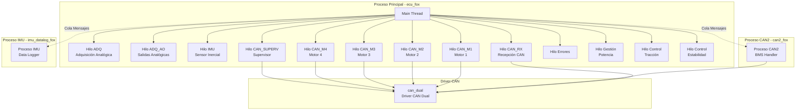

# Análisis de ECU_FOX_rc30-operativo

## 📋 Resumen Ejecutivo

Este documento analiza la estructura, conexiones y código reutilizable del proyecto **ECU_FOX_rc30-operativo**, un sistema de control electrónico para un vehículo eléctrico de 4 motores desarrollado para QNX Neutrino RTOS.

---

## 🏗️ Estructura del Proyecto

### Arquitectura General



### Estructura de Directorios

```
ECU_FOX_rc30-operativo/
├── Makefile                    # Makefile principal
├── fox.bld                     # QNX build file (producción)
├── fox_debug.bld              # QNX build file (debug)
├── copia_exes                 # Script para copiar ejecutables
├── script_fox                 # Script de inicio del sistema
├── script_usb                 # Script para montaje USB
│
├── proceso_ppal/              # PROCESO PRINCIPAL
│   ├── Makefile
│   ├── ecu_fox.c             # Main - Orquestador principal
│   ├── err_fox.c             # Gestión de errores
│   ├── can1_fox.c            # Comunicación CAN motores/supervisor
│   ├── canRx_fox.c           # Recepción CAN
│   ├── can_superv_fox.c      # Comunicación con supervisor
│   ├── tad_fox.c             # Adquisición datos analógicos
│   ├── tadAO_fox.c           # Salidas analógicas
│   ├── imu_fox.c             # Comunicación IMU
│   ├── gestionpot_fox.c      # Gestión de potencia
│   ├── ctrl_trac_estab_fox.c # Control tracción/estabilidad
│   └── include/
│       ├── constantes_fox.h      # Constantes del sistema
│       ├── estructuras_fox.h     # Estructuras de datos
│       ├── declaraciones_fox.h   # Prototipos funciones
│       ├── can.a                 # Librería CAN
│       ├── libUD-6.02.a          # Librería tarjeta adquisición
│       ├── pcm-3718hg_ho.h       # Header tarjeta ADQ
│       └── dscud.h               # Driver tarjeta ADQ
│
├── proceso_can2/              # PROCESO CAN BMS
│   ├── Makefile
│   ├── can2_fox.c            # Handler BMS vía CAN
│   └── include/
│       ├── can2_fox.h
│       ├── can.a
│       └── candef.h, canglob.h, canstr.h, saj1000.h
│
├── proceso_imu/               # PROCESO IMU DATALOG
│   ├── Makefile
│   ├── imu_datalog_fox.c     # Logger datos IMU
│   └── include/
│       └── imu_datalog_fox.h
│
└── driver_can/                # DRIVER CAN
    └── can_dual               # Ejecutable driver CAN dual
```

---

## 🔌 Conexiones entre Componentes

### 1. Comunicación Inter-Proceso

#### Colas de Mensajes (POSIX mqueue)

**Cola CAN2** (`/cola_can2`)
- **Productor**: `proceso_can2` (can2_fox)
- **Consumidor**: `proceso_ppal` (ecu_fox)
- **Datos**: Estructura `est_bat_t` (estado de baterías BMS)
- **Tamaño**: Definido por `TAMANHO_COLA_CAN2`

**Cola IMU** (`/cola_imu`)
- **Productor**: `proceso_ppal` (ecu_fox)
- **Consumidor**: `proceso_imu` (imu_datalog_fox)
- **Datos**: Estructura `dato_cola_imu_t` (datos IMU + errores)
- **Tamaño**: Definido por `TAMANHO_COLA_IMU`

### 2. Comunicación CAN

**Canal CAN 1** (1 Mbps)
- Supervisor (heartbeat, comandos)
- Motores 1-4 (telemetría, comandos)

**Canal CAN 2** (500 Kbps)
- BMS (Battery Management System)
- ID CAN: `ID_CAN_BMS`

### 3. Sincronización de Hilos

**Mutexes Principales**:
```c
pthread_mutex_t mut_supervisor;    // Protege est_superv_t
pthread_mutex_t mut_vehiculo;      // Protege est_veh_t
pthread_mutex_t mut_bateria;       // Protege est_bat_t
pthread_mutex_t mut_motor1/2/3/4;  // Protegen est_motor_t
pthread_mutex_t mut_errores;       // Protege est_error_t
pthread_mutex_t mut_potencias;     // Protege est_pot_t
pthread_mutex_t mDatosImu;         // Protege datosImu_t
```

**Condition Variables**:
```c
pthread_cond_t inicio;  // Sincroniza inicio de todos los hilos
```

---

## 📊 Estructuras de Datos Principales

### 1. Supervisor (`est_superv_t`)
```c
typedef struct {
    BOOL heartbeat;              // Heartbeat recibido
    BOOL enviado_off;            // Petición apagado enviada
    BOOL peticion_off;           // Debe apagarse
    BOOL on;                     // Sistema encendido
    BOOL motor_on[NUM_MOTORES];  // Motores habilitados
} est_superv_t;
```

### 2. Vehículo (`est_veh_t`)
```c
typedef struct {
    float acelerador;      // 0-5V
    float freno;           // 0-5V
    float volante;         // 0-5V
    float susp_ti/td/di/dd; // Suspensiones 4 ruedas
    float i_eje_d/t;       // Corriente ejes
    BOOL marcha_atras;
    BOOL act_acel;
} est_veh_t;
```

### 3. Batería (`est_bat_t`)
```c
typedef struct {
    BOOL error_com_tcan;
    BOOL error_com_bms;
    uint8_t num_cel_scan;        // Celdas detectadas (0-24)
    uint8_t temp_media;          // Temperatura media (°C)
    uint16_t v_medio;            // Voltaje medio (mV)
    uint32_t v_pack;             // Voltaje pack (mV)
    int16_t i_pack;              // Corriente pack (A)
    uint8_t soc;                 // Estado de carga (%)
    uint16_t timestamp;
    uint8_t nivel_alarma;        // 0-3 (nula/leve/grave/crítica)
    uint8_t alarma;              // Tipo alarma
    uint16_t mv_cel[NUM_CEL_BAT];   // Voltaje por celda
    uint8_t temp_cel[NUM_CEL_BAT];  // Temperatura por celda
} est_bat_t;
```

### 4. Motor (`est_motor_t`)
```c
typedef struct {
    char modelo[9];
    short version;
    BYTE zm_inf/sup_acel/fren;  // Zonas muertas
    float freno, acel;           // Señales leídas
    float v_pot, v_aux, v_bat;   // Tensiones
    BYTE i_a, i_b, i_c;          // Corrientes fases
    float v_a, v_b, v_c;         // Voltajes fases
    BYTE pwm;                    // Duty cycle
    BOOL en_motor_rot;
    BYTE temp_motor;
    BYTE temp_int/sup/inf_ctrl;
    uint16_t rpm;
    BYTE i_porcent;
    BOOL acel/freno/reverse_switch;
} est_motor_t;
```

### 5. IMU (`datosImu_t`)
```c
typedef struct {
    float pfAccelScal[3];    // Aceleración [x,y,z] (G)
    float pfGyroScal[3];     // Giroscopio [x,y,z] (rad/s)
    float pfEuler[3];        // [roll,pitch,yaw] (rad)
    uint32_t iTimeStamp;     // Ticks 16µs
    double pdLLHPos[4];      // Lat, Lon, Alt elipsoide, Alt MSL
    float pfNEDVeloc[6];     // Norte, Este, Abajo, Módulo, etc.
} datosImu_t;
```

### 6. Potencias (`est_pot_t`)
```c
typedef struct {
    float acelerador[NUM_MOTORES];  // Salidas 0-5V
    float freno[NUM_MOTORES];       // Salidas 0-5V
    BOOL act_freno[NUM_MOTORES];
    int16_t pot_deman;              // Potencia demandada
    int16_t pot_bat_act/sig;        // Potencia batería
    int16_t pot_motores_act/sig;    // Potencia total motores
    int16_t pot_m1/m2/m3/m4;        // Potencia por motor
} est_pot_t;
```

### 7. Errores (`est_error_t`)
```c
typedef struct {
    uint8_t error_leve/grave/critico;  // Flags
    uint16_t er_leve_1/2;
    uint16_t er_grave_1/2;
    uint16_t er_critico_1;
    uint16_t er_emergencia;
    uint16_t er_watchdog_bms/m1/m2/m3/m4;
} est_error_t;
```

---

## ⚙️ Sistema de Compilación

### Makefile Principal
```makefile
DIR1 = proceso_ppal
DIR2 = proceso_can2
DIR3 = proceso_imu

build:
    make -C proceso_ppal
    make -C proceso_can2
    make -C proceso_imu
```

### Makefile proceso_ppal
```makefile
CC = gcc
CFLAGS = -Wall
MATH_FLAG = -lm
SRC = ecu_fox.c err_fox.c can1_fox.c tad_fox.c tadAO_fox.c \
      canRx_fox.c can_superv_fox.c gestionpot_fox.c \
      ctrl_trac_estab_fox.c imu_fox.c
LIB_CAN = ./include/can.a
LIB_TAD = ./include/libUD-6.02.a
NOMBRE = ecu_fox
```

### QNX Build File (fox.bld)
- **Sistema Operativo**: QNX Neutrino RTOS
- **Bootloader**: BIOS
- **Filesystem**: QNX4 (raíz), DOS (datos)
- **Drivers**:
  - `devc-ser8250` (puerto serie COM)
  - `io-usb` (USB con EHCI/OHCI/UHCI)
  - `devb-eide` (IDE)
  - `pci-bios` (PCI)
- **Scripts de inicio**: `/ecu/script_fox`, `/etc/script_usb`

---

## 🔄 Flujo de Ejecución

### Secuencia de Inicio

1. **Main** (`ecu_fox.c`):
   - Inicializa estructuras globales
   - Bloquea señales
   - Crea colas de mensajes
   - Lanza procesos hijo (driver CAN, proceso CAN2, proceso IMU)
   
2. **Creación de Hilos** (orden):
   - **Hilos básicos**: ADQ, ADQ_AO, CAN_RX, IMU
   - Espera confirmación hilos básicos
   - **Hilos motores**: CAN_M1, CAN_M2, CAN_M3, CAN_M4
   - Espera confirmación hilos motores
   - **Hilos secundarios**: Errores, CAN_SUPERV, Gestión Potencia, Control Tracción, Control Estabilidad
   
3. **Sincronización**:
   - Broadcast condition variable `inicio`
   - Todos los hilos comienzan ejecución

4. **Bucle Principal** (50ms):
   - Recibe datos cola CAN2 (BMS)
   - Envía datos cola IMU
   - Imprime estado (cada 1 minuto)
   - Comprueba errores críticos

### Proceso CAN2 (BMS)

1. Conecta al driver CAN (canal 2, 500 Kbps)
2. Registra pulsos para recepción CAN
3. **Bucle**:
   - Espera pulso de mensaje CAN
   - Lee mensaje CAN con ID `ID_CAN_BMS`
   - Interpreta mensaje (voltaje/temperatura/estado/alarma)
   - Envía datos a cola → proceso principal

### Proceso IMU Datalog

1. Abre cola de mensajes
2. Crea fichero CSV con timestamp
3. **Bucle**:
   - Recibe datos de cola (timeout 3s)
   - Escribe datos IMU + errores en CSV
   - Crea nuevo fichero cada `NUM_MAX_DATOS_FICHERO` registros

---

## 🧩 Código Reutilizable para Nueva ECU

### ✅ Componentes Altamente Reutilizables

#### 1. **Estructuras de Datos** (`estructuras_fox.h`)
- ✅ `est_bat_t` - Gestión BMS
- ✅ `est_motor_t` - Telemetría motores
- ✅ `est_error_t` - Sistema de errores
- ✅ `datosImu_t` - Datos IMU
- ⚠️ `est_veh_t` - Adaptar sensores específicos
- ⚠️ `est_pot_t` - Adaptar según número motores

#### 2. **Sistema de Comunicación CAN**
- ✅ `can1_fox.c` - Framework comunicación CAN motores
- ✅ `canRx_fox.c` - Recepción CAN genérica
- ✅ `can_superv_fox.c` - Patrón comunicación supervisor
- ✅ Headers CAN (`candef.h`, `canstr.h`, `canglob.h`)

#### 3. **Proceso CAN2 BMS** (`can2_fox.c`)
- ✅ **Completamente reutilizable** si usas misma BMS
- Protocolo de mensajes BMS bien definido
- Gestión de errores robusta
- Sistema de colas implementado

#### 4. **Proceso IMU Datalog** (`imu_datalog_fox.c`)
- ✅ **Completamente reutilizable**
- Logger CSV con timestamps
- Rotación automática de ficheros
- Gestión de colas

#### 5. **Sistema de Errores** (`err_fox.c`)
- ✅ Clasificación errores (leve/grave/crítico)
- ✅ Watchdogs para componentes
- ✅ Actuaciones según gravedad

#### 6. **Gestión de Hilos**
- ✅ Patrón sincronización con condition variables
- ✅ Sistema de mutexes para estructuras compartidas
- ✅ Inicialización escalonada de hilos

### ⚠️ Componentes a Adaptar

#### 1. **Adquisición de Datos** (`tad_fox.c`, `tadAO_fox.c`)
- Específico para tarjeta **PCM-3718HG**
- **Acción**: Reemplazar con drivers de tu hardware ADC/DAC
- **Reutilizable**: Estructura general del hilo

#### 2. **IMU** (`imu_fox.c`)
- Protocolo específico de IMU utilizada
- **Acción**: Adaptar a tu modelo de IMU
- **Reutilizable**: Estructura de comunicación serie

#### 3. **Control Tracción/Estabilidad** (`ctrl_trac_estab_fox.c`)
- Algoritmos específicos del vehículo FOX
- **Acción**: Rediseñar según tu vehículo

#### 4. **Gestión Potencia** (`gestionpot_fox.c`)
- Lógica específica para 4 motores
- **Acción**: Adaptar a tu configuración

### ❌ Componentes No Reutilizables

- **Constantes** (`constantes_fox.h`) - Valores específicos del FOX
- **QNX Build Files** (`.bld`) - Configuración hardware específica
- **Scripts** (`script_fox`, `script_usb`) - Rutas específicas

---

## 📝 Recomendaciones para Nueva ECU

### 1. **Arquitectura Base**
```
✅ Mantener:
- Proceso principal multi-hilo
- Procesos separados para BMS y datalogging
- Sistema de colas POSIX
- Estructura de mutexes

⚠️ Adaptar:
- Número de motores
- Sensores específicos
- Hardware de adquisición
```

### 2. **Prioridades de Reutilización**

**Alta Prioridad** (copiar directamente):
1. `proceso_can2/` completo
2. `proceso_imu/` completo
3. `estructuras_fox.h` (base)
4. `err_fox.c` (sistema errores)
5. Headers CAN

**Media Prioridad** (adaptar):
1. `ecu_fox.c` (estructura main)
2. `can1_fox.c`, `canRx_fox.c`
3. `can_superv_fox.c`

**Baja Prioridad** (rediseñar):
1. Adquisición de datos
2. Control tracción/estabilidad
3. Gestión potencia

### 3. **Dependencias Externas**

```
Librerías necesarias:
- can.a          → Driver CAN (reutilizable)
- libUD-6.02.a   → Tarjeta ADQ (reemplazar)
- QNX Neutrino   → RTOS (mantener o portar a Linux)
- pthread        → Hilos POSIX (portable)
- mqueue         → Colas POSIX (portable)
```

### 4. **Portabilidad**

**QNX → Linux**:
- ✅ pthreads: Compatible
- ✅ mqueue: Compatible
- ✅ Estructuras: Portables
- ⚠️ Driver CAN: Reemplazar con SocketCAN
- ⚠️ Hardware I/O: Reemplazar `hw/inout.h`
- ❌ QNX-specific: `sys/neutrino.h`, `ChannelCreate()`, etc.

---

## 🔍 Puntos Clave del Diseño

### Fortalezas
1. ✅ **Separación de responsabilidades** clara
2. ✅ **Comunicación inter-proceso** robusta
3. ✅ **Sistema de errores** bien estructurado
4. ✅ **Sincronización** correcta con mutexes
5. ✅ **Logging** de datos IMU persistente

### Áreas de Mejora
1. ⚠️ Código específico de hardware mezclado con lógica
2. ⚠️ Constantes hardcodeadas (mejor usar config files)
3. ⚠️ Comentarios en español (dificulta colaboración internacional)
4. ⚠️ Falta documentación de protocolo CAN

---

## 📚 Archivos Clave para Estudiar

### Para entender la arquitectura:
1. [ecu_fox.c](file:///C:/Users/ahech/Desktop/FOX/ECU_FOX_rc30-operativo/ECU_FOX_rc30-operativo/proceso_ppal/ecu_fox.c) - Main, creación hilos
2. [estructuras_fox.h](file:///C:/Users/ahech/Desktop/FOX/ECU_FOX_rc30-operativo/ECU_FOX_rc30-operativo/proceso_ppal/include/estructuras_fox.h) - Todas las estructuras
3. [declaraciones_fox.h](file:///C:/Users/ahech/Desktop/FOX/ECU_FOX_rc30-operativo/ECU_FOX_rc30-operativo/proceso_ppal/include/declaraciones_fox.h) - Prototipos

### Para comunicación CAN:
1. [can2_fox.c](file:///C:/Users/ahech/Desktop/FOX/ECU_FOX_rc30-operativo/ECU_FOX_rc30-operativo/proceso_can2/can2_fox.c) - Proceso BMS
2. [can1_fox.c](file:///C:/Users/ahech/Desktop/FOX/ECU_FOX_rc30-operativo/ECU_FOX_rc30-operativo/proceso_ppal/can1_fox.c) - CAN motores
3. [canRx_fox.c](file:///C:/Users/ahech/Desktop/FOX/ECU_FOX_rc30-operativo/ECU_FOX_rc30-operativo/proceso_ppal/canRx_fox.c) - Recepción

### Para datalogging:
1. [imu_datalog_fox.c](file:///C:/Users/ahech/Desktop/FOX/ECU_FOX_rc30-operativo/ECU_FOX_rc30-operativo/proceso_imu/imu_datalog_fox.c) - Logger IMU

---

## 🎯 Checklist para Nueva ECU

- [ ] Definir número de motores
- [ ] Seleccionar hardware ADC/DAC
- [ ] Elegir modelo IMU
- [ ] Decidir RTOS (QNX vs Linux)
- [ ] Copiar `proceso_can2/` completo
- [ ] Copiar `proceso_imu/` completo
- [ ] Adaptar `estructuras_fox.h` a tus necesidades
- [ ] Copiar sistema de errores (`err_fox.c`)
- [ ] Adaptar main (`ecu_fox.c`) según tus hilos
- [ ] Implementar drivers hardware específico
- [ ] Definir protocolo CAN para tus motores
- [ ] Configurar IDs CAN
- [ ] Implementar control tracción/estabilidad
- [ ] Crear scripts de inicio
- [ ] Documentar protocolo CAN

---

**Fecha de análisis**: 2025-11-25  
**Versión ECU analizada**: rc30-operativo  
**Autor original**: Elena González (2013)
